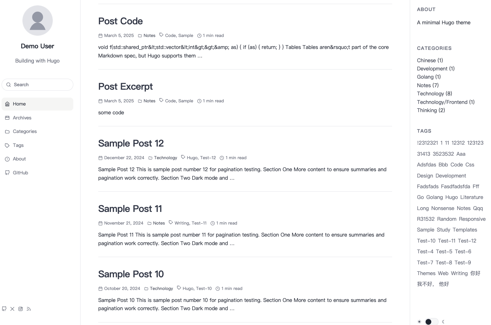

# Nonentity

A minimal, responsive, searchable Hugo blog theme. Three-column layout: left nav sidebar, content, right sidebar (TOC / tags / categories).



## Features

- No JavaScript frameworks
- Responsive — collapses to rail nav on tablet, drawer nav on mobile
- Full-text search across posts, pages, tags, and categories
- Table of contents with scroll tracking
- Tag filtering with AND/OR mode
- Giscus comments, Cloudflare Analytics, RSS
- Syntax highlighting (GitHub light / Dracula dark)
- Light and dark color scheme with instant switching

## Requirements

Hugo `>= 0.111.3`

## Installation

### Git submodule

```bash
git submodule add https://github.com/snowme34/hugo-theme-nonentity themes/nonentity
```

Set `theme = "nonentity"` in `hugo.toml`.

### Hugo module

```toml
[module]
  [[module.imports]]
    path = "github.com/snowme34/hugo-theme-nonentity"
```

## Configuration

All options go under `[params]` in `hugo.toml` unless noted otherwise.

### Site

```toml
[params]
  description           = "Used in <meta name=description> for SEO."
  footerText            = "Text shown at the bottom of every page."
  keywords              = ["blog", "developer"]   # <meta name=keywords>
  dateFormat            = "January 2, 2006"       # Go time format
  favicon               = "/images/favicon.png"   # Path to favicon
  enableRSS             = true                    # Adds RSS link in <head> and sidebar footer
  showColorSchemeToggle = true                    # Show the light/dark toggle button
  rightSidebarInfo      = "Text shown in the right sidebar info panel. Falls back to description if not set."
  rightSidebarInfoTitle = "About"                 # Title of the right sidebar info panel
```

### Pagination

```toml
[params]
  paginate         = 15   # Posts per page on home and section lists
  paginateArchive  = 10   # Posts per page on archive (/post/)
  paginateTaxonomy = 5    # Posts per page on a single tag or category page (e.g. /tags/hugo/)
  paginateTags     = 15   # Posts per page in the tag filter results on /tags/
```

### Profile card

Shown at the top of the left sidebar.

```toml
[params.profile]
  avatar = "/images/avatar.png"  # Path to avatar image
  name   = "Your Name"
  bio    = "Short bio line"
  link   = "/"                   # Where clicking the avatar goes
```

### About link

By default the "About" nav item links to your local `about/` page. Set `params.about.url` to redirect it to an external URL instead.

```toml
[params.about]
  url = "https://example.com/about"   # omit to use the local about/ page
```

### Social links

Displayed in the sidebar footer. Sorted by `weight` (ascending).

Built-in icon names: `github`, `x`, `instagram`, `mastodon`, `youtube`, `bilibili`, `rss`.

```toml
[[params.socials]]
  name   = "GitHub"
  url    = "https://github.com/you"
  icon   = "github"
  weight = 1
```

For a custom icon, use `iconSvg` instead of `icon`:

```toml
[[params.socials]]
  name    = "My Site"
  url     = "https://example.com"
  iconSvg = "<svg ...></svg>"
  weight  = 10
```

### Extra left nav items

Add custom links to the left sidebar navigation, either before (`prepend`) or after (`append`) the default items.

```toml
[params.leftNavExtra]
  enable = true

  [[params.leftNavExtra.items]]
    name     = "GitHub"
    link     = "https://github.com/you"
    location = "append"   # "append" or "prepend"
    svg      = "<svg ...></svg>"
```

### Table of contents

Enabled globally here; can be overridden per-page with `toc: false` in front matter.

```toml
[params.toc]
  enable = true

[markup.tableOfContents]
  startLevel = 2
  endLevel   = 4
```

### Copyright and license badge

```toml
[params.copyright]
  text = "© 2026 Your Name"

  [params.copyright.license]
    enable = true
    name   = "CC BY-NC-SA 4.0"
    image  = "/images/cc-by-nc-sa.png"
    link   = "https://creativecommons.org/licenses/by-nc-sa/4.0/"
```

### Comments (Giscus)

Requires a public GitHub repo with Discussions enabled. Get your IDs at [giscus.app](https://giscus.app).

```toml
[params.comments.giscus]
  enable          = true
  repo            = "username/repo"
  repoID          = "R_..."
  category        = "General"
  categoryID      = "DIC_..."
  mapping         = "pathname"
  strict          = "0"
  reactionsEnabled = "1"
  emitMetadata    = "0"
  inputPosition   = "bottom"
  theme           = "preferred_color_scheme"
  lang            = "en"
  loading         = "lazy"
```

Comments are rendered only on pages in the `post` section.

### Analytics (Cloudflare)

```toml
[params.analytics.cloudflare]
  enable = true
  token  = "your-beacon-token"
```

### Required Hugo settings

These must be present for syntax highlighting and search to work correctly.

```toml
[markup.highlight]
  noClasses = false   # Required: use CSS classes, not inline styles

[outputs]
  home = ["HTML", "JSON", "RSS"]  # Required: JSON output powers search
```

## Front matter

| Key | Type | Description |
| --- | --- | --- |
| `categories` | string[] | Categories for this post. |
| `tags` | string[] | Tags for this post. |
| `toc` | bool | Per-page TOC override. `true` forces it on, `false` forces it off, regardless of the global `params.toc.enable` setting. |
| `comment` | bool | Set to `false` to disable comments on a specific post. Has no effect if comments are not globally enabled. |
| `excerpt` | string | Custom summary shown in post lists. Falls back to the first 180 characters of the page's plain text. |
| `description` | string | Page `<meta name="description">` for SEO. Takes highest priority; falls back to `excerpt`, then the auto-generated summary, then `params.description`. |

## Design Credit

A rewrite from scratch for [hexo-theme-symphony](https://github.com/snowme34/hexo-theme-symphony), which is my fork of

- [hexo-theme-pure](https://github.com/cofess/hexo-theme-pure)
- [hexo-theme-dawn](https://github.com/Ruffianjiang/hexo-theme-dawn)

## License

MIT — see [LICENSE](LICENSE).
